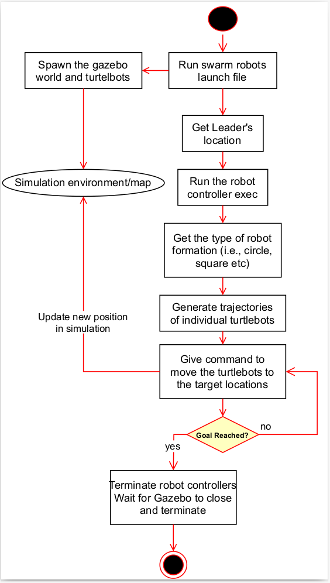
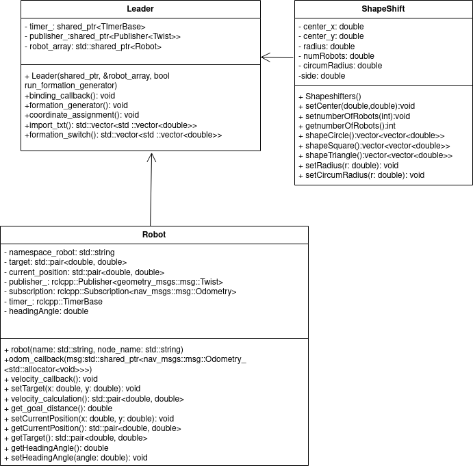
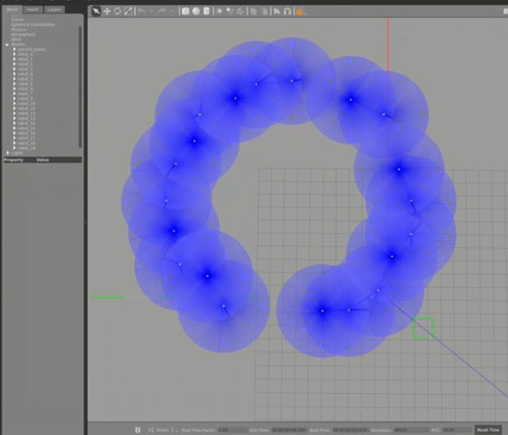
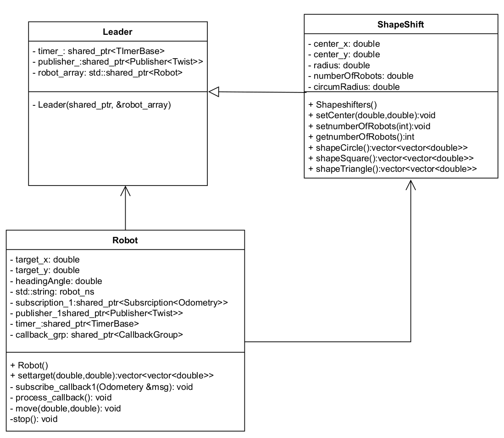
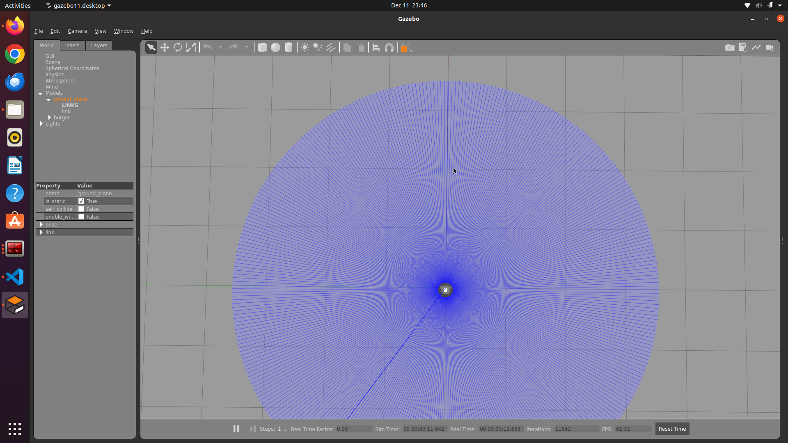

# Project ShapeShifters
 [](https://codecov.io/gh/shivamsehgal77/ShapeShifters)
[](https://opensource.org/license/mit/)

## Description
The project demonstrates a swarm control algorithm on a group of turtlebot robots. The turtlebot swarm executes a shape formation of different shapes when seen from the top view autonomously based on user input. The swarm will follow a leader follower configuration.

## Phase-2 Progress:
During phase to we implemented the design, created the simulation, since we followed API and TDD you can see our backlog for this sprint below.

| ID | Task                                     | Sprint | Estimated Time (hrs) |
|----------|--------------------------------------------------------|----------|-----------------------|
| 2.1      | Create urdf folder to include turtlebot3 burger model files | 2        | 10                    |
| 2.2      | Change launch files to spawn multiple turtlebots      | 2        | 60                    |
| 2.3      | Create a publisher to publish to cmd_vel of one turtlebot | 2        | 10                    |
| 2.4      | Updating CMakeLists and package.xml                   | 2        | 5                     |
| 2.5      | Update UML diagrams                                    | 2        | 20                    |
| 2.6      | Update Readme                                          | 2        | 10                    |
| 2.7      | Create a subscriber to subscribe to odom of 1 turtlebot | 2        | 10                    |
| 2.8      | Update publisher to publish to multiple turtlebots    | 2        | 20                    |
| 2.9      | Update launch file for launching multiple turtlebots  | 2        | 20                    |
| 2.10     | Update subscriber to subscribe to multiple turtlebots | 2        | 25                    |
| 2.11     | Create HPP for all classes                             | 2        | 30                    |
| 2.12     | Write function in robot formation program to form a square | 2        | 60                    |
| 2.13     | Create level 1 test cases                               | 2        | 60                    |
| 2.14     | Update UML diagrams                                    | 2        | 20                    |
| 2.15     | Create header file for formation in ROS (hpp)         | 2        | 30                    |
| 2.16     | Create the implementation for the formation in ROS (cpp) | 2        | 30                    |
| 2.17     | Create main file (cpp)                                 | 2        | 25                    |
| 2.18     | Create Level 2 tests (rostest)                         | 2        | 90                    |
| 2.19     | Add bash script for generating coverage report         | 2        | 25                    |
| 2.20     | Modify ROS formation HPP to include 2 more formations  | 2        | 40                    |
| 2.21     | Write function in robot formation program to form a triangle | 2        | 20                    |
| 2.22     | Write function in robot formation program to form a circle | 2        | 20                    |
| 2.23     | Update cpp to implement the ROS formation              | 2        | 50                    |
| 2.24     | Modify launch file to spawn 24 robots                  | 2        | 30                    |
| 2.25     | Do CPP lint and CPP check and resolve errors           | 2        | 10                    |
| 2.26     | Add script to generate coverage report                 | 2        | 5                     |
| 2.27     | Update test cases                                      | 2        | 2                     |
| 2.28     | Update GitHub workflow                                 | 2        | 10                    |
| 2.29     | Resolving GitHub workflow errors                       | 2        | 10                    |
| 2.30     | Adding Doxygen comments to code                        | 2        | 20                    |
| 2.31     | Update Readme to include all deliverables              | 2        | 30                    |
| 2.32     | Create an Iteration 2 development Branch               |          | 10                    |
| 2.33     | Pull request and Merge the Development Branch with Main branch |          | 5                     |
| 2.34     | Optimize code for coverage increase                    |          | 2                     |
| 2.35     | Update author names and file header comments           |          | 10                    |


### Results
Below are the screenshots of UML and the launch file:

* Activity diagram



* Class diagram 



* Shape example




General progress, accomplishments, problems encountered can be found on the following presentation:
https://docs.google.com/presentation/d/1W6J0OQgDlOtNGRTyHkPeD6P_r9gWOQOXk3N45q3PqNw/edit#slide=id.g2a89b81276e_0_13


## Phase-1 Progress:
1. Design inital UML class and activity diagrams
2. Setup code coverage in codecov
3. Add launch files for launching a single turtlebot in empty world
4. Add template integration and unit tests

### Results
Below are the screenshots of UML and the launch file:

* Activity diagram


* Class diagram 



* Launch File run example




## Personnel
1. 
2. 
3. 


## Build and Run Instructions
```bash
# Source to ROS2 HUMBLE
source /opt/ros/humble/setup.bash
# Make your ros2 workspace
mkdir ros2_ws
# Go to the source directory of your ros2 workspace
cd ~/ros2_ws
git clone https://github.com/shivamsehgal77/ShapeShifters.git
# Install process
## Ensure you have necessary packages installed
rosdep install -i --from-path src --rosdistro humble -y
sudo apt -y install ros-humble-desktop-full
sudo apt -y install ros-humble-gazebo-ros-pkgs
sudo apt -y install ros-humble-turtlebot3*
# Install rosdep dependencies before building the package
rosdep install -i --from-path src --rosdistro humble -y
# Build the package using colcon build
colcon build --packages-select ShapeShifters --symlink-install --cmake-args -DCMAKE_EXPORT_COMPILE_COMMANDS=ON --parallel-workers $(nproc)
# After successfull build source the package
. install/setup.bash
# ROS2 launch file run in terminal window#1
ros2 launch shape_shifters gazebo_launch.py
# ROS2 node run in terminal window#2
ros2 run shape_shifters main_node  # Ctrl-C to stop the simulation in both terminals 
```

## AIP and Product Backlog
1. Work Log and Sprint Log are at [Link](https://docs.google.com/spreadsheets/d/1ph1sYep433EigfkVelYI8igBHbYIN74LMEw9CF0V7-I/edit?usp=sharing)
2. Final Proposal Report [Link](https://docs.google.com/document/d/1y6ZIHWb2QU3o7JkHODOUfTqYlNkz0YVxSIHP77x4x8U/edit?usp=sharing)
3. Video for Phase 1 [Link](https://drive.google.com/file/d/1UDKtr_CeyR_4nH1GlqVb55ZY5pjcLDt4/view?usp=sharing)

## CppCheck & CppLint
```bash
# Use the below command for cpp check by moving to root directory of your workspace
cppcheck --enable=all --std=c++17 --suppress=missingIncludeSystem $( find . -name *.cpp | grep -vE -e "^(./build/|./install/|./log/)" ) --check-config  &> cppcheck.txt

# Use the below command for cpp lint by moving to root directory of your workspace 
cpplint  --filter=-build/c++11,+build/c++17,-build/namespaces,-build/include_order $( find . -name *.cpp | grep -vE -e "^(./build/|./install/|./log/)" ) &> cpplint.txt 
```

## Test run instructions and test coverage report generation
Test run
```bash
colcon test --packages-select shape_shifters # Command to run the test
cat log/latest_test/shape_shifters/stdout_stderr.log # Command to view the test result
```
Coverage report
```bash
colcon build --cmake-args -DCOVERAGE=ON
colcon test
source install/setup.bash 
ros2 run shape_shifters generate_coverage_report.bash 
open {workspace_path}/install/shape_shifters/coverage/index.html
```

## Docs generation
```bash
sudo apt install -y doxygen lcov gcovr pandoc
colcon build --event-handlers console_cohesion+ --packages-select shape_shifters --cmake-target "docs"
```
